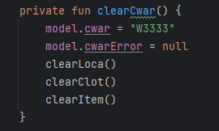

# Тема проекта: Разработка прототипа мобильного приложения «Инвентаризация»
## Цель: Разработать прототип мобильного приложение на базе операционной системы Android для терминала сбора данных Honeywell EDA50k-1, реализующее задачи инвентаризации складских запасов АО «Балтийский завод».  
### Задачи:
* получить и оформить список функциональных требований;
* получить и оформить список нефункциональных требований;
* спроектировать архитектуру;
* подобрать необходимые инструменты;
* выполнить программную реализацию;
* провести функциональное тестирование; 
### Инcтрументы:  Android Studio, Kotlin, Hilt, Room, DataStore, Navigation, Git

### Структура дипломного проекта:
1. ВВЕДЕНИЕ (~1 стр.) 
2. ПОСТАНОВКА ЗАДАЧИ (~14 стр.)
* Функциональные требования
* Нефункциональные требования	
3. ПРОЕКТИРОВАНИЕ АРХИТЕКТУРЫ (~7 стр.)
* Чистая архитектура	
* Hilt
* MVVM
* Navigation
* Room
* DataStore
* Архитектура приложения
4. ПРОГРАММНАЯ РЕАЛИЗАЦИЯ (~15 стр.)
* Среда разработки и система сборки проекта
* Зависимости
* Создание структуры проекта
* База данных
* Верстка интерфейса
* Файловые ресурсы
* DataStore ресурсы	
* Barcode
* Use cases
* ViewModel
* Ссылка на github
5. ТЕСТИРОВАНИЕ	(~9 стр.)
6. ЗАКЛЮЧЕНИЕ	(~1 стр.)
7. СПИСОК ИСПОЛЬЗОВАННЫХ ИСТОЧНИКОВ	(~1 стр.)
8. Приложения (~33 стр.)
---
### Ссылка на диплом - https://github.com/iamseryy/warehousemobileapplication/blob/main/docs/diplom.docx
### Ссылка на apk приложения - https://github.com/iamseryy/warehousemobileapplication/blob/main/app/release/app-release.apk
### Ссылка на Honeywell_MobilitySDK_Android -  https://github.com/iamseryy/warehousemobileapplication/blob/main/docs/Honeywell_MobilitySDK_Android_v1.00.00.0054.zip
---
## Особенности тестирования

1.	Инструкция по эксплуатации приложения представлена в Приложении 4 диплома.
2.	Необходимые DataMatrix коды представлены в Приложении 1 диплома.
3.	Файл для импорта данных инвентаризации import.csv доступен по ссылке на github проекта -   https://github.com/iamseryy/warehousemobileapplication/tree/main/docs
4.	Пароль в раздел приложения settings для импорта/экспорта файла – 111
5.	Полное функциональное тестирование приложения в соответствии с функциональными требованиями возможно только на терминалах сбора данных Honeywell EDA50k-1.
6.	Частичное тестирование, не требующее штатного сканера терминалах сбора данных Honeywell EDA50k-1, возможно с использованием Android Studio и Android Virtual Device. Дляы этого необходимо в класс MainViewModel в функции clearCwar() задать значение поля склад cwar = “W3333”, как на рисунке. 

Это необходимо, т.к. в соответствии с функциональными требованиями значение поля склад заполняется только через штатный сканер терминала сбора данных. Остальные поля - место, изделие, партия, доступны для изменения вручную, см. инструкцию по эксплуатации Приложение 4 диплома.
